# tp-final-seminario

Trabajo práctico final de la materia "Seminario Intensivo de Tópicos Avanzados en Datos Complejos", materia de la Maestría en Ciencia de Datos del ITBA. 

Este Trabajo consiste en la creación de un proyecto end to end de datascience utilizando un entorno ya creado de Docker y tecnologías de Big Data como Spark.

Integrantes:
- Manuel Cassiani
- Juan Pablo Casal

## Problemática a resolver

Los canales de reserva de hoteles en línea han cambiado radicalmente las posibilidades de reserva y el comportamiento de los clientes. Un número significativo de reservas de hotel se anulan por cancelaciones o por no presentarse. Los motivos típicos de las cancelaciones son cambios de planes, conflictos de horarios, etc. A menudo, esto se ve facilitado por la posibilidad de hacerlo de forma gratuita o, preferiblemente, a bajo coste, lo cual es beneficioso para los clientes del hotel, pero supone un factor menos deseable y que posiblemente disminuya los ingresos con los que tienen que lidiar los hoteles.

El objetivo de este trabajo es armar un modelo que pueda predecir los clientes que van a cancelar su reserva, de manera de que otro cliente pueda aprovechar esta habitación vacía y que no se transforme en una pérdida económica para el hotel.

dataset utilizado: https://www.kaggle.com/datasets/ahsan81/hotel-reservations-classification-dataset?resource=download

proyecto: jupyter/notebook/hotel_reservations.ipynb

## Contenido del notebook:
* 1 - Importacion dataset y configuracion Schema
* 2 - Primer EDA
* 3 - Valores Nulos y Constantes
* 4 - Ingeniería de atributos
* 5 - Preparación de datos para realizar modelos ML
* 6 - Árbol de decisión
* 7 - Random Forest
* 8 - Postgres

### 1 - Importacion dataset y configuracion Schema

En esta etapa se crea la sesión de spark y se levanta el dataset hotel_reservations.csv
Además se define el esquema de la tabla, columnas de tipo entero, columnas de tipo flotante y columnas de tipo string.

### 2 - Primer EDA

En este primer análisis de datos se realizaron los siguientes estudios:

* Mapa de calor (correlación entre variables)

 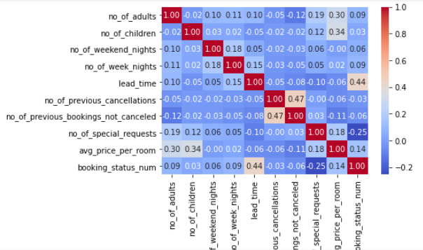

* Distplot

 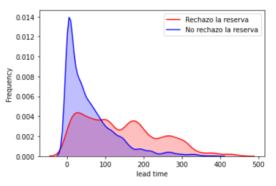

* Countplot

 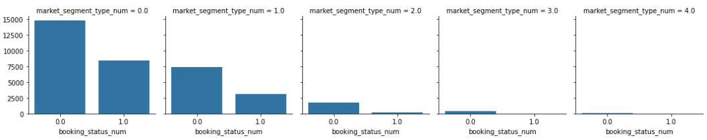

### 3 - Valores Nulos y Constantes

**Valores Nulos:** No contamos con valores nulos.

 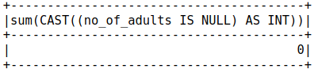
 
**Valores Constantes:** La mayoría de las variables tienen una desviación estandar por debajo de la unidad. De todas formas decidimos no eliminar ninguna variable. Luego de evaluar el modelo de ML y determinar la importancia de variables tomaremos una decisión sobre si es necesario eliminar alguna.

 
### 4 - Ingeniería de atributos

Se han generado las siguientes 10 variables nuevas:
* total_ocupantes: suma entre numero de adultos y numero de niños.
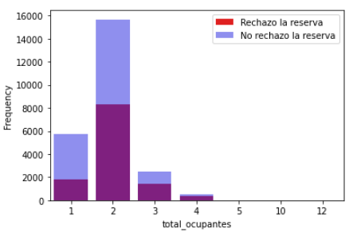
* total_dias: suma entre cantidad de dias de la semana y cantidad de días del fin de semana reservados.
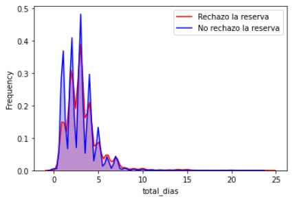
* precio_x_ocupante: cociente entre el precio promedio de la habitación y el total de ocupantes.
* precio_x_adulto: cociente entre el precio promedio de la habitación y el numero de adultos, en caso de no haber adultos esta variable se mapea con el precio promedio.
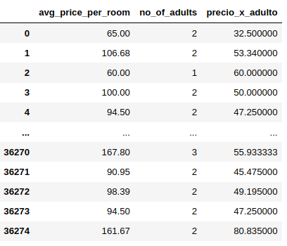
* temporada_USA: primavera, verano, otoño o invierno (USA).
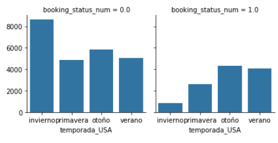
* rango_de_montos: Se transformó la variable continua de montos en una variable discreta, los rangos son los siguientes '<60', '60-80', '80-120', '120-150', '>150'.
* type_of_meal_plan_SUM_room_type_reserved: suma entre las variables 'type_of_meal_plan' y 'room_type_reserved'.
* market_segment_type_SUM_room_type_reserved: suma entre las variables 'market_segment_type' y 'room_type_reserved'.
* market_segment_type_SUM_repeated_guest: suma entre las variables 'market_segment_type' y 'repeated_guest'.
* rango_de_montos_SUM_temporada_USA: suma entre las variables 'type_of_meal_plan' y 'temporada_USA'.

### 5 - Preparación de datos para realizar modelos ML
Previo a entrenar el dataset para generar el modelo de ML se deben realizar ciertos preprocesos:

* Eliminación de variables: se eliminaron variables innecesarias como el ID y variables que pueden romper el algoritmo como las variables del tipo string (previamente estas variables fueron duplicadas y se les realizaron un encoding).
* Balanceo de datos: debido a que el desbalanceo en la proporción de las clases no es tan elevado, se decidió no balancear el dataset y trabajar con la misma cantidad de filas.
* Checkeo de nulos: gracias a este preproceso pudimos detectar una falla en la creación de uno de los atributos derivados. Si alguno de los datos fuera nulo, luego los algoritmos que utilizamos para entrenar el modelo fallarían.
* Vector assembler: para entrenar los modelos con los algoritmos de ML y utilizando spark, es necesario pasarle cada una de las filas (sin la etiqueta) en formato vector.
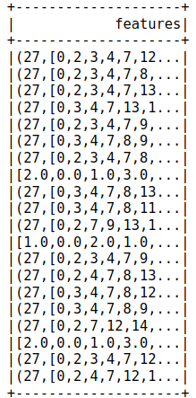
* Train/Test: se utilizó un 70% de los datos para entrenamiento y el 30% restante para evaluar el modelo.
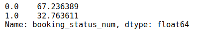

### 6 - Árbol de decisión
**AUC:** 0.72

**Feature Importance:**
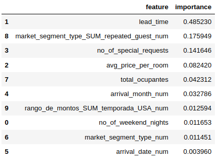

### 7 - Random Forest
**AUC:** 0.88

**Feature Importance:**
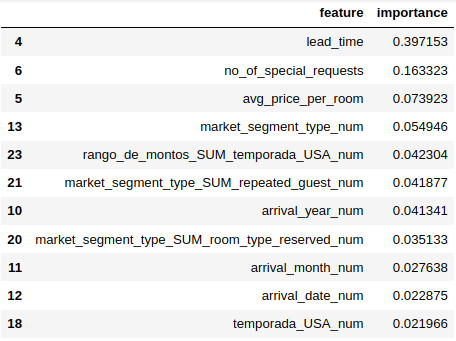

No solo que el random forest devolvió mejores resultado en torno al AUC, sino que también probamos los resultados para diferentes semillas y en el caso del árbol de decisión los valores de AUC variaban mucho, en cambio para el random forest los valores de AUC tuvieron poca variabilidad, es decir el random forest es un modelo mas robusto y con mayor probabilides de evitar tener grandes problemas con el overfitting.

### 8 - Postgres

Finalmente se guardaron los datasets que se utilizaron para el entrenamiento y test del modelo en una base de datos en postgres.

